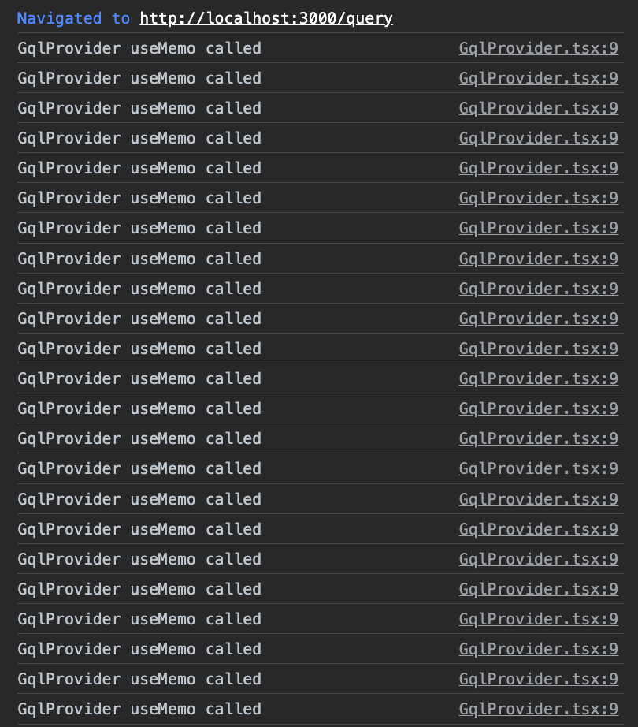

This is a reproducible example code which uses URQL with Next.js (v13, App Router) framework.

## Reproduction Steps:

1. Run app

```sh
$ npm install
$ npm run dev
```

2. Open a web browser and visit `http://localhost:3000` then open Developer Tools.

3. Click the link that will lead you to '/query' page.

4. Check the console messages. (Sometimes it works fine but Reload will trigger the Problem.)

```ts
import { createUrqlClientAndSsr } from "@/graphql";

export default function GqlProvider({ children }: React.PropsWithChildren) {
  const [client, ssr] = React.useMemo(() => {
    console.log("GqlProvider useMemo called");
    return createUrqlClientAndSsr();
  }, []);

  return (
    <UrqlProvider client={client} ssr={ssr}>
      {children}
    </UrqlProvider>
  );
}
```



- I don't know why GqlProvder is initializing infinitely.
